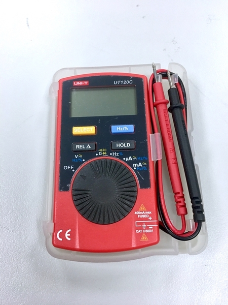
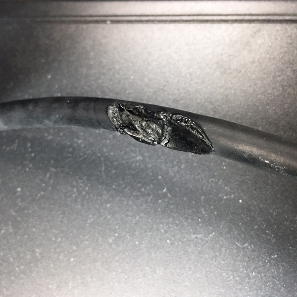

# 焊接初學者指南

*Soldering Guide for Beginners*  

## 焊接設備

### 必要設備

以下是焊接時所需要的設備:

#### 電烙鐵

* 建議買 30W 以上的，一般市面上賣的也幾乎是 30W 起跳
* 60W 可以焊大面積的接點 (ex: 帶鋁基板的 LED 模組)
* 有些烙鐵還會有進階溫控的功能

#### 烙鐵架

* 大部分的烙鐵架都會有一區用來置放海綿
* 海綿用來清除烙鐵頭上多餘的焊錫
	* 海綿浸濕後，完全擰乾水份使用

#### 焊錫

* 有鉛。183℃ 化錫 (60/40 比率的鉛/錫含松香的焊錫最易於使用)
* 無鉛。217℃ 化錫

* 有另一種台灣稱為 "錫筆" 的包裝

#### 斜口鉗

* 焊接 DIP 元件時，剪除多餘的線

SMT 元件(表面黏著技術)

DIP 插件:

#### 剝線鉗

剝除線材的外皮

### 除錫設備

以下是當你需要去除焊錫的時候所需的設備:

#### 吸錫器

* 利用空氣吸力

#### 吸錫線

* 利用毛細現象
* 使用時銅帶會發熱
* 使用方法: [影片](https://www.youtube.com/watch?v=BrAJpz9Mdm4)

### 其他設備

以下是非必要的設備，但是有的話更好。

#### 三用電表 (建議買)

用來測試焊接的結果是否造成短路

#### 烙鐵頭清潔銅絲球

銅絲球的好處是清除烙鐵頭上多餘的焊錫時，不會使烙鐵頭的溫度降低 (比起使用沾水的海綿)。

#### 不鏽鋼防靜電鑷子

輔助固定零件、拆除零件

#### 防焊膠帶

* 美紋紙膠帶
	* 黏性較強、可用來固定元件、可寫字 XD

* 耐高溫防焊膠帶(褐色)
	* 黏性較差、耐高溫、一般用來絕緣使用。

* 也有人建議使用萬用黏土貼。但缺點是受熱太久會牽絲 XD

#### 熱縮套管

* 將焊點做絕緣使用
* 根據不同的線徑選擇不同直徑的套管
* 加熱會縮小
	* 使用熱風槍（或吹風機）
	* 烙鐵頭尾端
	* 打火機

#### 第三隻手

 

## 焊接小知識

* 只有銅箔的地方會吃錫。PCB 的表層不會。

 

* 焊錫含有松香（助焊劑）
	* 加熱焊錫時，如果感覺有被東西噴到，通常就是揮發的松香。
	* 當松香燒完的時候，焊錫或有牽絲感

## 焊接安全事項

* 電線不要出現在你的移動範圍內
* 注意走線方向，如果你慣用右手，盡量將烙鐵架置放在右手邊 (線從右邊來)。
* 如果你的烙鐵架重量太輕，可以使用膠帶固定電線，以免拉扯時掉到你的腿上。
* 導線的部分在焊接時會因為熱傳導發熱，焊錫絲則不會。

* 文件: [焊接安全注意事項.pdf](焊接安全注意事項.pdf)

## 焊接操作步驟

* 基本思想是在「最佳時間」以「最佳溫度」加熱「適量的焊料」。
* 盡量在 3~5 秒內完成
	* 如果周邊有 IC 元件，加熱太久可能會損換元件
	* 加熱太久也可能造成銅箔剝離
* 小心周圍的塑膠元件，不要不小心融到它
* 當你有很多元件要焊接上 PCB 電路板時，一個順序原則是 -- 從元件高度較低的開始焊。 

1. 固定好你要焊接的元件/線材（使用膠帶、甚至是鉗子壓著）
2. 先將電烙鐵上殘存的焊錫清除（可以使用海綿或是銅絲球）
3. 一手拿焊錫，一手拿電烙鐵
4. 可以在電烙鐵尖端上一點點焊錫，以增加導熱接觸面積
5. 將電烙鐵靠近觸碰焊點，再把焊錫絲送進去

 

因為只有銅箔區域可以吃錫，表面張力的影響會讓焊錫在銅箔區形成飽滿的焊點。

焊點樣子: Good

焊點樣子: OK

各種焊點結果判別

如果要焊接多蕊線，可以先上焊錫整理成一束，再連接到焊點。

* 注意外皮的部分會因為受熱而有些內縮

## 電烙鐵保養

* 每次焊接之前，清除殘餘的焊錫
* 每次焊接動作結束後，若長時間不會使用，放回烙鐵架之前先上焊錫在烙鐵頭避免氧化
* 盡可能地使用最低可用溫度焊接。高溫易使烙鐵頭氧化。

* 如果你是 60W 的電烙鐵，又沒有溫控系統，可以買 250W 的調光線降低使用功率。
	* ex: WS-5007 調光線

## 參考資料

* [如何焊接 by 黃信惠的瘋狂教室](https://www.davidhuanglab.com/solderingiron?fbclid=IwAR01_P67pcvMrxJvvaOfSDN_Xe_xbITE-iQzLNZHjMKZCOcO6CuRAoc30Y0)
* [Collin's Lab: Desoldering](https://www.youtube.com/watch?v=N_dvf45hN6Y)
* [Collin's Lab: Soldering](https://www.youtube.com/watch?v=QKbJxytERvg&t=153s)
* [10 STUPID ERRORS To AVOID in Soldering and TIPS](https://www.youtube.com/watch?v=Fp37DPZVdRI)
* [How to Make Cool Things with Microcontrollers (For People Who Know Nothing)](http://mightyohm.com/files/soldercomic/translations/FullSolderComicChineseTraditional.pdf) 漫畫版 (中文翻譯)
* [Adafruit Guide To Excellent Soldering](https://learn.adafruit.com/adafruit-guide-excellent-soldering?view=all)
* [How to Solder: Through-Hole Soldering by Sparkfun](https://learn.sparkfun.com/tutorials/how-to-solder-through-hole-soldering/all)
* [When to use Flux ?](https://www.youtube.com/watch?v=tfIwHuGzUEk)